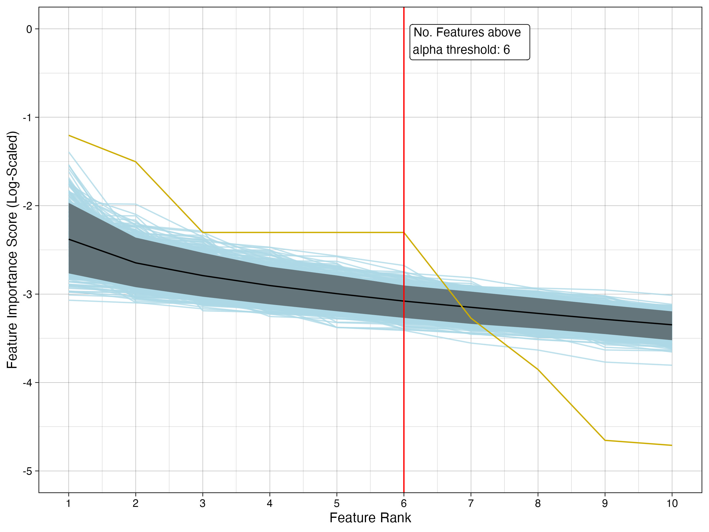
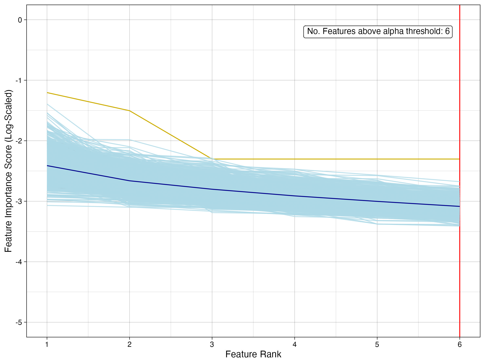
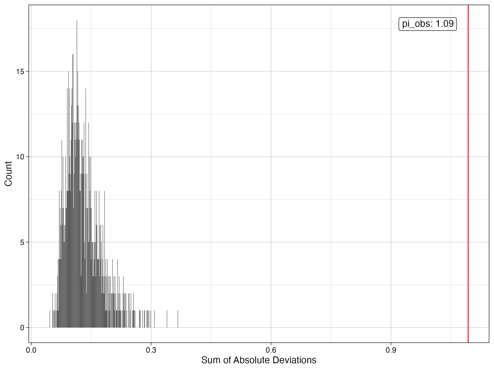
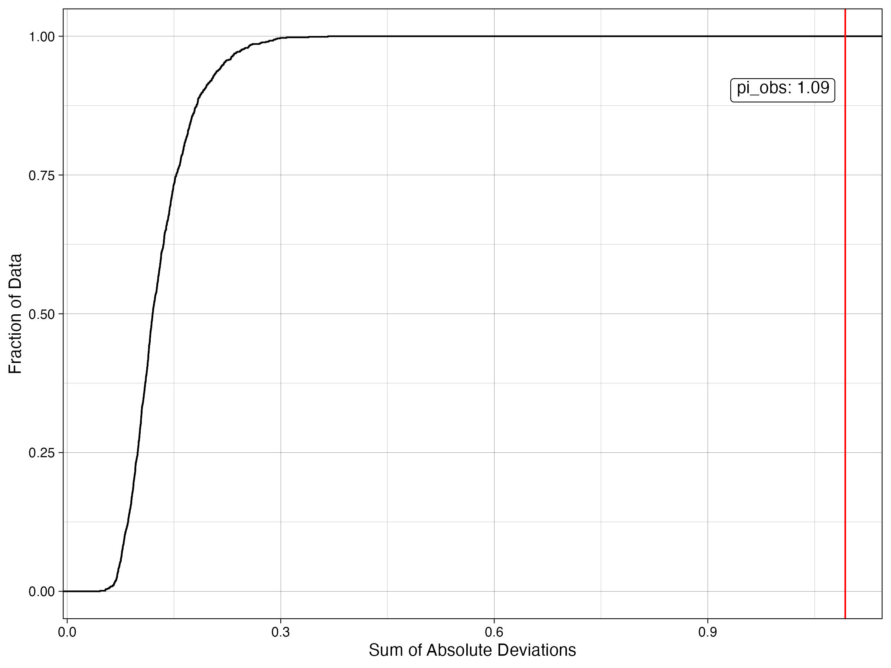
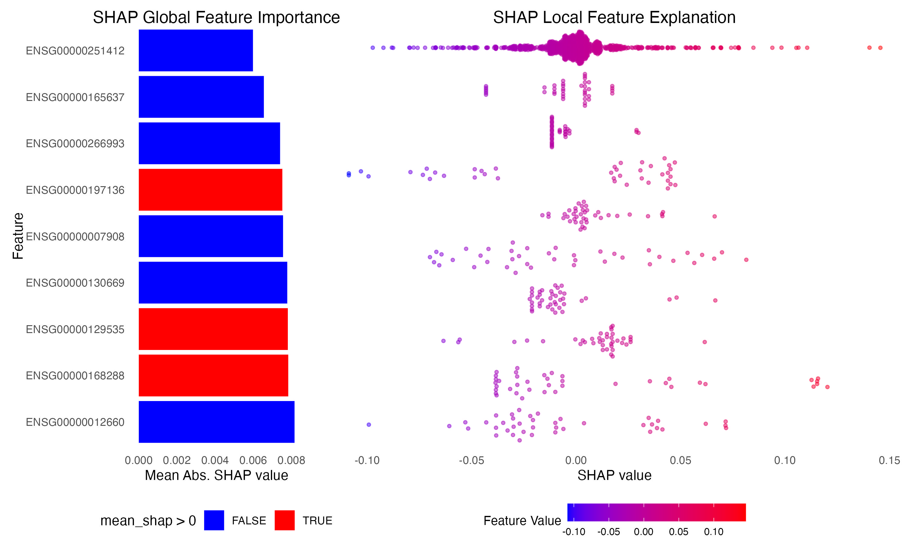
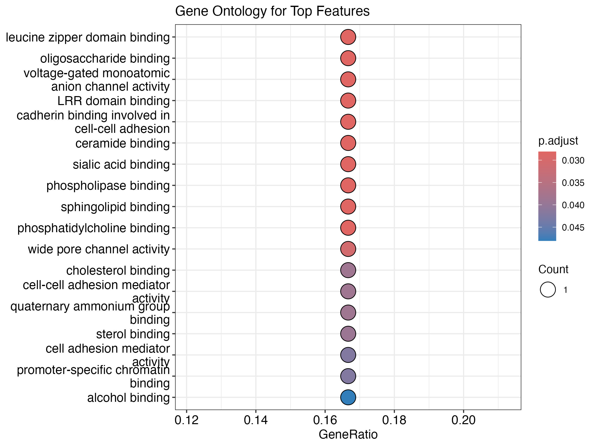
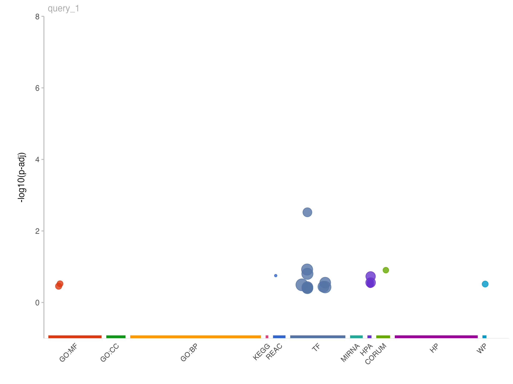
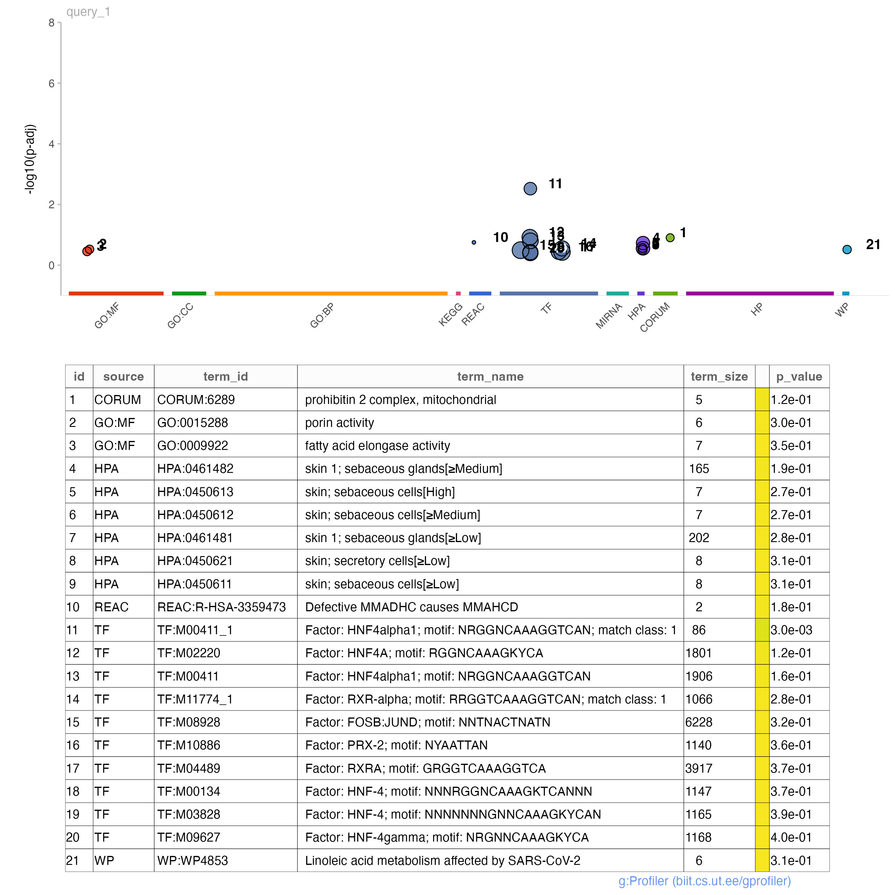
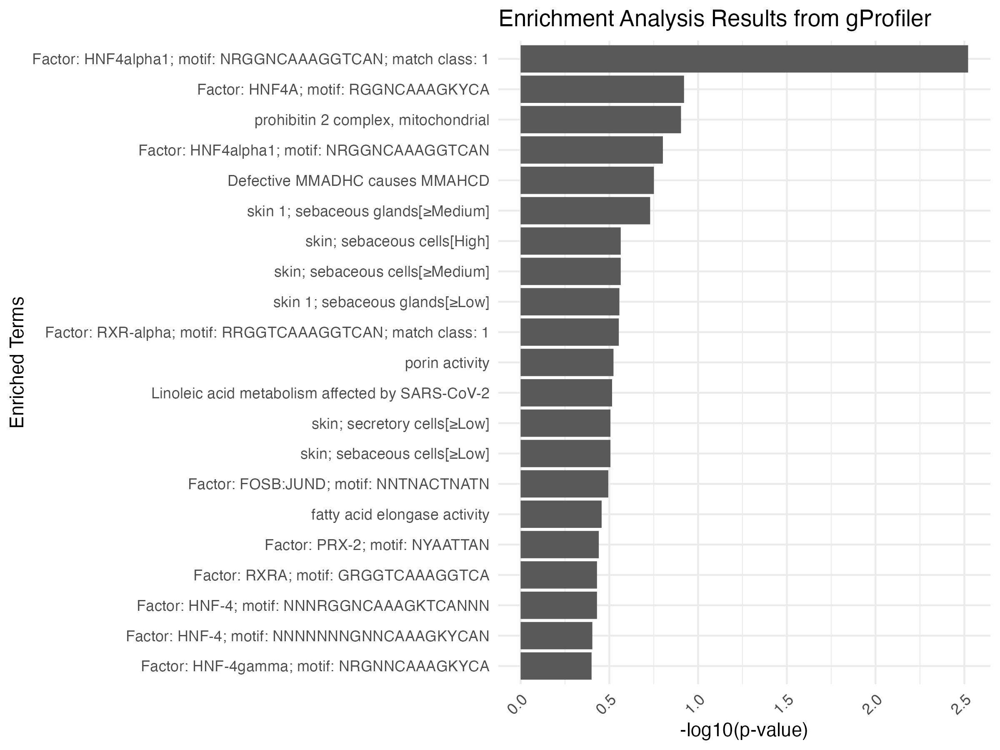

```{r, include = FALSE}
knitr::opts_chunk$set(
  collapse = TRUE,
  comment = "#>"
)

```

\newpage
\vspace{1cm}

# Introduction to pyRforest

**Welcome to pyRforest:** A comprehensive tool for genomic data analysis featuring scikit-learn Random Forests in R. Tailored for expression data, such as RNA-seq or Microarray, pyRforest is built for bioinformaticians and researchers looking to explore the relationship between biological features and a matched binary outcome variable using Random Forest models. Please read on for instructions that will guide you through pyRforest's seamless integration of scikit-learn's Random Forest methodologies (imported to R via reticulate) for model development, evaluation, SHAPley additive explanations, and our custom feature reduction approach by way of rank-based permutation. You will also be directed you through our integration with clusterProfiler and g:Profiler for Gene Ontology and Enrichment Analysis.

This vignette will guide you through:

-   pyRforest's integration of scikit-learn's Random Forest methodologies (via `reticulate`).

-   Data preparation for use in pyRforest (and scikit-learn).

-   Model development and evaluation.

-   Our custom feature reduction approach using rank-based permutation.

-   Integration with SHAP for feature directionality interpretation.

-   Integration with clusterProfiler and g:Profiler for gene set enrichment & gene ontology analysis.

## About pyRforest

Consider pyRforest if you:

-   Have a genomic dataset (e.g. RNA-seq or Microarray) with a binary outcome variable.

-   Aim to develop and evaluate Random Forest models from Python's scikit-learn through our custom R wrapper.

-   Seek permutation and rank-based feature reduction, yielding a list of significant features.

-   Require a memory efficient way to build Random Forest models on large genomic datasets in R.

pyRforest offers:

-   Python scikit-learn's superior Random Forest class balancing, GRIDSearchCV hyperparameter tuning with cross-validation, efficient memory management, sparse-data handling, and parallelization.

-   A final list of reduced features with corresponding p-values for indicating statistical significance.

-   Publication-ready plots to help visualize the feature reduction approach.

-   SHAP values for understanding feature influence on the outcome.

-   Integration with clusterProfiler and g:Profiler for gene set enrichment & GO analysis.


For more information and to contribute to the pyRforest package, please visit the [GitHub repository](https://github.com/tkolisnik/pyRforest).

## License
This package is licensed under the [BSD 3-Clause License](https://github.com/tkolisnik/ShinyGEExplorer/blob/main/LICENSE.txt).

This package is an independent project, not officially endorsed or maintained by the creators of scikit-learn. The package includes modified scikit-learn code as allowed by the creators of scikit-learn under their [BSD 3-Clause License](https://opensource.org/licenses/BSD-3-Clause).

# R Package Installation and Setup

For the best experience, we recommend the installation of R version 4.3.1, and [RStudio by Posit](https://posit.co/products/open-source/rstudio/) version 023.09.1+494 or later, for installing and running the pyRforest package.

```{r, eval=FALSE, tidy=TRUE}
# Installation:
# 1. Install devtools if not already installed:
install.packages("devtools")
library(devtools)

# 2. Use devtools to install pyRforest
devtools::install_github("tkolisnik/pyRforest")

# 3. Load pyRforest
library(pyRforest)
```

This package has been developed on Apple mac (M1 arm64). It does not work properly on windows machines due to incompatibilties with the back-end paralellization of model building. It has been tested and works on Linux and [posit Cloud](https://posit.cloud/).

This package leverages [scikit-learn's](https://scikit-learn.org/stable/) random forest model using the R package reticulate to allow us to execute [Python](https://www.python.org/) code within [R](https://www.r-project.org/about.html). Therefore, in order to use this package you must first install python 3.9.18 and [reticulate](https://rstudio.github.io/reticulate/) and optionally [conda](https://conda.io/projects/conda/en/latest/user-guide/install/index.html), and setup either a reticulate virtualenv (linux) or a conda environment (mac) with python 3.9.18, scikit-learn 3.1.2, numpy 1.26.0, shap 0.43.0 and their dependencies.

This package requires the R package reticulate (version 1.34.0 recommended) [reticulate](https://rstudio.github.io/reticulate/) is installed and loaded by running the commands:

```{r, eval=FALSE, tidy=TRUE}
# First ensure reticulate is installed:
if (!requireNamespace("reticulate")) {
    install.packages("reticulate")
}

# If using reticulate's virtualenv (recommended for Linux):

# Initial setup:
library(reticulate)
reticulate::install_python(version = "3.9.18")
Sys.setenv(WORKON_HOME = "virtualenvs")
reticulate::virtualenv_create(envname = "pyRforest-venv", python_version = "3.9.18", packages = c("scikit-learn==1.3.2", "numpy==1.26.0", "shap==0.43.0"))
reticulate::use_virtualenv("pyRforest-venv")

# Subsequent usage after initial setup:
library(reticulate)
Sys.setenv(WORKON_HOME = "virtualenvs")
use_virtualenv("pyRforest-venv")

# If using conda (recommended for M-series Arm64 Macs):
library(reticulate)
# Install python 3.9.18 if not already installed: https://www.python.org/downloads/macos/ and ensure it is located at /usr/local/bin/python3. 
reticulate::use_python("/usr/local/bin/python3")
reticulate::conda_install(envname = "pyRforest-conda", python_version = "3.9.18",packages = c("scikit-learn==1.3.2", "numpy==1.26.0", "shap==0.43.0"))
reticulate::use_condaenv("pyRforest-conda", required = TRUE)

# Subsequent usage after initial setup:
library(reticulate)
use_condaenv("pyRforest-conda-arm64mac", required = TRUE)

# You can check if environment setup has worked by running:
reticulate::py_config()

# If environment installation has worked, the previous command will result in an output message similar to:

#python:         /opt/homebrew/Caskroom/miniconda/base/envs/pyRforest-conda/bin/python
#libpython:      /opt/homebrew/Caskroom/miniconda/base/envs/pyRforest-conda/lib/libpython3.9.dylib
#pythonhome:     /opt/homebrew/Caskroom/miniconda/base/envs/pyRforest-conda:/.../pyRforest-conda
#version:        3.9.18 
#numpy:          /opt/homebrew/Caskroom/miniconda/base/envs/pyRforest-conda/lib/python3.9/sit...
#numpy_version:  1.26.0
#sklearn:        /opt/homebrew/Caskroom/miniconda/base/envs/pyRforest-conda/lib/python3.9/sit...
# NOTE: Python version was forced by use_python() function

# You may now proceed to using the package
```

## Installation Notes:

You can also build your conda environment outside of Rstudio in the terminal.

For more information on dependency installation see:

<https://www.python.org/downloads/>

<https://brew.sh/>

<https://conda.io/projects/conda/en/latest/user-guide/install/index.html>

<https://docs.conda.io/projects/miniconda/en/latest/>

## Troubleshooting

If when trying to load your environment you get the following error:

ERROR: The requested version of Python ('path/env/python') cannot be used, as another version
of Python ('/usr/local/bin/python3') has already been initialized. Please restart the R session if you need to attach reticulate to a different version of Python.
Error in use_python(python, required = required) : 
  failed to initialize requested version of Python
  
Then press session -> restart R -> then reload your environment 

# Data Preparation

Load and prepare your datasets. This R package comes pre-loaded with an RNA-seq dataset which can be loaded using:

```{r, eval=FALSE}
data("demo_rnaseq_data", package = "pyRforest")
```

<details>

<summary><strong>Structuring Your Data for Machine Learning</strong></summary>

<p>To facilitate the use of our machine-learning tools, we recommend structuring your expression and target data similarly to our demo dataset. This section will guide you through this process and provide illustrative examples.</p>

<p>Your data should be saved as a list containing four tibbles. Each tibble functions similarly to a data frame but offers additional benefits in handling and manipulating large datasets. Below is an overview of the structure and purpose of each tibble:</p>

<h4>Training, Validation, and Testing Tibbles</h4>

<ul>

<li><strong>Identifier:</strong> A unique identifier for each row (e.g., "2041-04-12-1"), representing a sample or patient. This is crucial for tracking and referencing data points.</li>

<li><strong>Target:</strong> A binary variable (0 or 1) indicating the outcome to be predicted. It simplifies the outcome variable for machine learning purposes.</li>

<li><strong>Gene Expression Data:</strong> The remaining columns, such as ENSG00000253497 and ENSG00000238493, contain gene expression data, here represented as RNA-seq counts. Each column corresponds to a specific gene.</li>

</ul>

<h4>Target Categories Tibble</h4>

<ul>

<li>Includes the full list of identifiers (identifier) from the training, validation, and testing datasets.</li>

<li>The <em>target_categorical</em> column provides the outcome variable in a categorical format. The <em>target</em> column provides the outcome variable in binary format. This dataframe is primarily used to assist with mapping for SHAP and to assist the user keep track of their data. </li>

<li>Essential for mapping and identification purposes across all datasets.</li>

</ul>

</details>

<details>

<summary><strong>Best Practices for Data Splitting</strong></summary>

<p>In machine learning, datasets are typically split into three parts:</p>

<ul>

<li><strong>Training Dataset:</strong> Used to train the machine learning model. It learns to make predictions or classify data based on this set.</li>

<li><strong>Validation Dataset:</strong> Used to tune the parameters of the model and provide an unbiased evaluation of a model fit during the training phase. It helps in providing a check against overfitting.</li>

<li><strong>Testing Dataset:</strong> Used to provide an unbiased evaluation of the final model fit. It's only used after the model training and validation phases are complete.</li>

</ul>

<p>These splits help in effectively training the model and evaluating its performance in a way that is generalizable to new, unseen data.</p>

<p>Standard Recommendations for Dataset Splitting: [It's a common practice](https://encord.com/blog/train-val-test-split/) to use around 60-80% of the data for training, and the remaining 20-40% split between validation and testing. However, these ratios can vary based on the size and specifics of your dataset.</p>

</details>

<br> <br> <strong>Example data structures expected by pyRforest:</strong><br> *These are tibbles which should be saved into one list variable*

```{r dataframe-creation, echo=FALSE}
library(knitr)
load("../data/demo_rnaseq_data.RData")

kable(head(demo_rnaseq_data$training_data[1:10,1:6], 10), 
      caption = "training_data", 
      align = 'l')

kable(head(demo_rnaseq_data$validation_data[1:10,1:6], 10), 
      caption = "testing_data", 
      align = 'l')

kable(head(demo_rnaseq_data$testing_data[1:10,1:6], 10), 
      caption = "validation_data", 
      align = 'l')

kable(head(demo_rnaseq_data$target_categories[1:10,1:3], 10), 
      caption = "target_categories", 
      align = 'l')
```

*Recall .RData files are created using the command:* <code>save(variable_name, file="path/to/file") </code> <br> and loaded using <code>load("path/to/file")</code>

Alternatively, instead of using the .RData format, expression data can be imported through other approaches such as CSV or TSV. Here is another example of loading data from CSV file formats. Ensure each file is structured with the correct data and columns, as shown in the tables above.

```{r, eval=FALSE}
# Load target data:
training_data <- read_csv("/path/to/file/training_data.csv")
validation_data <- read_csv("/path/to/file/validation_data.csv")
testing_data <- read_csv("/path/to/file/testing_data.csv")
target_categories <- read_csv("/path/to/file/target_categories.csv")
```

and then these variables should be combined into a list of tibbles using:

```{r, eval=FALSE}
# Load the tibble package
library(tibble)

# Ensure each dataset is converted to a tibble and combine them into a list
demo_rnaseq_data <- list(
  training_data = as_tibble(training_data),
  validation_data = as_tibble(validation_data),
  testing_data = as_tibble(testing_data),
  target_categories = as_tibble(target_categories)
)
```

# Data Preprocessing

```{r, eval=FALSE, tidy=FALSE}
# This function prepares a dataset for scikit-learn random forest machine learning by 
# creating a matrix from the dataset excluding certain columns, and extracting a 
# target vector. It isflexible and can handle different types of data sets such as 
# training, testing, or validation.
# Data must be in the correct input format, see vignette or example dataset for details.

processed_training_data <- pyRforest::create_feature_matrix(
  dataset = demo_rnaseq_data$training_data, 
  set_type = "training"
  )

processed_validation_data <- pyRforest::create_feature_matrix(
  dataset = demo_rnaseq_data$validation_data, 
  set_type = "validation"
  )

processed_testing_data <- pyRforest::create_feature_matrix(
  dataset = demo_rnaseq_data$testing_data,
  set_type = "testing"
  )
```

# Model Tuning

```{r, eval=FALSE, tidy=FALSE}
# This function uses scikit-learn's python based GridSearchCV to perform hyperparameter 
# tuning and training of a RandomForestClassifier. It allows for customizable parameter 
# grids and includes preprocessing steps of one-hot encoding and scaling. The function 
# is designed to find the best hyperparameters based on accuracy. Please reference the 
# scikit-learn GridSearchCV documentation for the full description of options, 
# however our defaults are comprehensive.

# If running default custom_parameter_grid:
tuning_results <- pyRforest::tune_and_train_rf_model(
                                  X = processed_training_data$X_training_mat, 
                                  y = processed_training_data$y_training_vector,
                                  cv_folds = 5,
                                  scoring = 'roc_auc',
                                  seed = 4,
                                  n_jobs = 1,
                                  n_cores = 7
                                  )

print(tuning_results$grid_search$best_params_)
print(tuning_results$grid_search$best_score_)

# If not running defaults and customization of parameter is desired:
custom_parameter_grid <- list(
  bootstrap = list(TRUE),
  class_weight = list(NULL),
  max_depth = list(5L, 20L, NULL),
  n_estimators = as.integer(seq(10, 90, 10)),
  max_features = list("sqrt", 0.2),
  # It is not recommended to change criterion, as gini is required by pyRforest functions.
  criterion = list("gini"), 
  warm_start = list(FALSE),
  min_samples_leaf = list(1L, 50L),
  min_samples_split = list(2L, 200L)
)

# Train a model and perform hyperparameter tuning using pyRforest. 
# This can be extremely time, memory, and processing-power consuming,
# and scales rapidly with dataset size. 
# A small dataset such as the demo data may take >5 minutes, 
# However, a larger 300 x 50,000 dataset may take days depending on the number of 
# cores used.
# It is strongly recommended to parallelize computing by increasing n_cores.
# 1 less than the total number of cores on your processor is recommended.

tuning_results <- pyRforest::tune_and_train_rf_model(
                                  X = processed_training_data$X_training_mat, 
                                  y = processed_training_data$y_training_vector,
                                  cv_folds = 5,
                                  scoring = 'roc_auc', 
                                  seed = 123, 
                                  param_grid = custom_parameter_grid,
                                  n_jobs = 1,
                                  n_cores = 7
                                  )

# After the model is tuned, print the best parameters and the best score. 
# See scikit-learn documentation for interpreting scores. 
# It is recommended to re-tune on different parameters if score is not adequate.

print(tuning_results$grid_search$best_params_)
print(tuning_results$grid_search$best_score_)

```

# Fit and Evaluate the Random Forest model

## Validation scoring

```{r, eval=FALSE, tidy=FALSE, tidy.opts=list(width.cutoff=45)}
# This function fits a Random Forest model using the provided hyperparameters 
# and training data, then evaluates its performance on a validation set.

# Fit the results to the validation set to check performance:

fitting_results <- pyRforest::fit_and_evaluate_rf(
                              best_params = tuning_results$best_params, 
                              X_train = processed_training_data$X_training_mat, 
                              y_train = processed_training_data$y_training_vector,
                              X_val = processed_validation_data$X_validation_mat, 
                              y_val = processed_validation_data$y_validation_vector
                              )

# Print the fitting results, provides accuracy, f1 score, precision, recall 
# and roc_auc scores on the model as fitted to the validation set.
print(fitting_results)

# If performance is not adequate, you may want to reconstruct your model, tweak 
# your data, and rerun step 7 before proceeding.

# If you want to manually assign your parameters you can do so by running this code:
# Note: you must include an L after all integers (eg 10L) to force them to remain as 
# integers during the list to python dict conversion. 
best_params_manual <- list(
  bootstrap = TRUE,
  class_weight = NULL,
  criterion = 'gini',
  max_depth = 10L, # Keep the L!
  max_features = 0.2, # Decimal numbers do not need the L
  min_samples_leaf = 2L, # Keep the L!
  min_samples_split = 2L, # Keep the L!
  n_estimators = 100L, # Keep the L!
  warm_start = FALSE,
  verbose = TRUE
)

# Use reticulate to convert the R list to a Python dict.
new_best_params <- reticulate::dict(best_params_manual)
```

## Testing scoring

```{r, eval=FALSE, tidy=FALSE, tidy.opts=list(width.cutoff=45)}
# This function is also used to evaluate the testing set when the model is finalized.
# Depending on your goals, you may want to initially skip scoring on this set 
# and re-build your model onthe reduced feature set and re-run previous steps 
# before proceeding.
# For reporting purposes. You should not run this code until your model is locked down. 

fitting_results_testing <- pyRforest::fit_and_evaluate_rf(
                                      best_params = tuning_results$best_params, 
                                      X_train = processed_training_data$X_training_mat, 
                                      y_train = processed_training_data$y_training_vector,
                                      X_val = processed_testing_data$X_testing_mat, 
                                      y_val = processed_testing_data$y_testing_vector
                                      )

# Print the fitting results, provides accuracy, f1 score, precision, recall 
# and roc_auc scores on the model as fitted to the validation set.
print(fitting_results_testing)

```

# Permute the model and obtain feature importances

```{r, eval=FALSE, tidy=FALSE}
# This function fits a Random Forest model and calculates the true and permuted feature
# importances. It performs permutations on the target variable to generate permuted 
# importances for comparison.
# This step is time consuming and scales with training set size and the number of
# permutations used. (Approx. 5 mins to 3 hours+).

feat_importances <- pyRforest::calculate_feature_importances(
                                      model = fitting_results$model,
                                      X_train = processed_training_data$X_training_mat,
                                      y_train = processed_training_data$y_training_vector,
                                      n_permutations = 1000
                                      )

# Print top features from model pre-Rank-based feature reduction
print(feat_importances$top_features)
```

# Calculate Significance Metrics

## Calculate Quantiles

```{r,eval = FALSE, tidy=FALSE}
# Calculate quantiles
# This function computes the mean, lower, and upper quantiles of permuted feature 
# importance scores and compares them with the observed importance scores from the
# true values. 
# It is used to assess the significance of feature importances from random forest 
# models by comparing them against a distribution of importances obtained through 
# permutation. Necessary for figures.
quantile_data <- pyRforest::calculate_quantiles(
                          truevalues = feat_importances$true_importances, 
                          permutedvalues = feat_importances$permuted_importances,
                          alpha = 0.05
                          )
```

## P-values for entire feature set

```{r,eval = FALSE, tidy=FALSE}

# Calculate p-value for the entire feature set
# This function calculates the proportion-based p-value for the entire feature set 
# by comparing the observed sum of absolute deviations from the mean feature importance 
# to those from permuted data. It is particularly useful in permutation tests to assess
# the statistical significance of the observed data.
pvalue_set <- pyRforest::calculate_full_set_pvalue(
                        permutedvalues = feat_importances$permuted_importances, 
                        quantiledata = quantile_data
                        )
```

## P-values for each rank

```{r,eval = FALSE, tidy=FALSE}
# Calculate p-value for each rank
# This function calculates p-values for each feature rank in the dataset by comparing 
# the observed feature importances against the distribution of importances in the
# permuted data.
# It returns ranks and their respective p-values and proportions up to a 
# specified alpha threshold.
# Note: P-values returned as 0 actually represent p-values less than the smallest 
# detectable limit. With 1,000 permutations, the smallest detectable p-value
# is 0.001 (1/n_permutations).
# Therefore, a reported p-value of 0 should be interpreted as p < 0.001.

pvalues_ranks <- pyRforest::calculate_ranked_based_pvalues(
                        truevalues = feat_importances$true_importances, 
                        permutedvalues = feat_importances$permuted_importances, 
                        alpha = 0.05
                        )

# Print top features from model post-Rank based feature reduction
print(pvalues_ranks)
```

# Generate Plots

## Feature Importance Plots
```{r, eval = FALSE, tidy=FALSE}
# Generate Full feature importance plot
# This function generates a figure which shows the true observed data plotted against the 
# permuted data, by rank. The intersection of the true data with the upper quartile is 
# shown, which we recommend as a significance cutoff. Note: There are ample parameters 
# for controlling the axes scale, label location, and zoom, because of data variability, 
# you will almost certainly have to adjust these to fit your plot.

fiplot_full <- pyRforest::generate_fi_rank_plot(
  permutedvalues = feat_importances$permuted_importances, 
  quantiledata = quantile_data, 
  xlimitmin = 1, 
  xlimitmax = 10, 
  ylimitmin= -5, 
  ylimitmax = 0, 
  labelhorizontaladjust = -0.05,
  labelverticaladjust = 1.5,
  focusedView = FALSE,
  logOn = TRUE
  )
# Tip:
# For best quality it is recommended to save plots using the ggsave() function
# e.g. ggsave("/path/fiplot_full.jpeg", plot = last_plot(), 
#            width = 8, height = 6, dpi = 300)
print(fiplot_full)

```

```{r, echo=FALSE, fig.align='center', out.width='100%'}

```

```{r, eval = FALSE, tidy=FALSE}
# Same plot as above, but zoomed to show only the significant results
fiplot_focused <- pyRforest::generate_fi_rank_plot(
  permutedvalues = feat_importances$permuted_importances, 
  quantiledata = quantile_data, 
  xlimitmin = 1, 
  xlimitmax = 10, 
  ylimitmin= -5, 
  ylimitmax = 0, 
  labelhorizontaladjust = 1.05,
  labelverticaladjust = 1.5,
  focusedView = TRUE,
  logOn = TRUE
  )

print(fiplot_focused)
```

```{r, echo=FALSE, fig.align='center', out.width='100%'}

```
<br>

## pi Histogram

```{r, eval = FALSE, tidy=FALSE}
# Generate pi Histogram plot
# Creates a histogram showing the sum of absolute deviations by count, the measures 
# used to calculate the pi statistics used in the p-value calculation for the set.
pihist_plot <- pyRforest::generate_pi_histogram(
  permutedvalues = feat_importances$permuted_importances, 
  quantiledata = quantile_data
  )

print(pihist_plot)

```

```{r, echo=FALSE, fig.align='center', out.width='100%'}

```

<br>

## ECDF Plot

```{r, eval = FALSE, tidy=FALSE}
# Generate ECDF plot
# Creates a plot of the empirical cumulative density function showing the sum of 
# absolute deviations by fraction of data.
ecdf_plot <- pyRforest::generate_pi_ECDF_plot(
  permutedvalues = feat_importances$permuted_importances,
  quantiledata = quantile_data)

print(ecdf_plot)
```

```{r, echo=FALSE, fig.align='center', out.width='100%'}

```

<br>

<div style="font-size: 24px; font-weight: bold;">
Advanced Features
</div>

<div style="font-size: 18px; font-weight: bold;">
Explore advanced functionalities of pyRforest such as SHAP value analysis, or use it to plug into additional gene ontology, enrichment and gprofiler modules.
</div>

# [SHAP](https://shap.readthedocs.io/en/latest/) Analysis

```{r, eval=FALSE, tidy=FALSE}
# Produce a list of SHAP values
# This function calculates SHAP values for a given dataset using a provided model. 
# It then identifies significant features based on the SHAP values for the specified
# class.
# Additionally, it prepares a long-format data frame of individual SHAP values 
# suitable for visualization.

shapvals <- pyRforest::calculate_SHAP_values(
  model = fitting_results$model, 
  data = processed_training_data$X_training_mat, 
  class_index = 1, # In demo, 1 represents Right
  shap_std_dev_factor = 0.5
  )

# Print the mapping list to remind of binary mapping and aid with SHAP plot 
# directionality interpretation.
# If class_index = 1, in the demo this represents the features contribution
# towards the "Right". Thus in the plot 'red' coloured features could be considered
# to be positively contributing to "Right" side predictions, and 'blue' coloured 
# features negatively to "Right" side predictions (or positively to "Left").

unique_mapping <- unique(
  demo_rnaseq_data$target_categories[, c("target_categorical", "target")]
  )
print(unique_mapping)
 
# Produce the SHAP Plots
# Generates a combined bar and beeswarm plot to show direction, 
# as well as global and local feature importances.
shapplot <- pyRforest::generate_shap_plots(
  mean_shap_values = shapvals$significant_features,
  long_shap_data = shapvals$long_shap_data
  )

print(shapplot)
```

```{r, echo=FALSE, fig.align='center', out.width='100%'}

```

<br>

# [GO Enrichment](https://bioconductor.org/packages/release/bioc/html/clusterProfiler.html) Analysis

```{r, eval=FALSE, tidy=FALSE}
library(clusterProfiler)
library(org.Hs.eg.db) # Assuming human data, see bioconductor for other organism dbs.
library(enrichplot)

# We have 3 lists of significant features from our data that can be explored further

# 1. The 'raw' list of siginificant features from the RF model:
print(feat_importances$top_features)

# 2. The list of significant features after rank-based permutation feature reduction
# This is the most conservative, statistically stringent list:
print(pvalues_ranks)

# 3. The list of significant features from the SHAP analysis
# Can be further divided by directionality +/-:
print(shapvals$significant_features)

# Subsequent steps can be ran on any of these feature lists,
# although if the list is too small these steps may not produce results.
features_list <- shapvals$significant_features$feature # Features from SHAP

# Alternatively:
#features_list <- pvalues_ranks$feature # Post-rank based feature reduction list
#features_list <- feat_importances$top_features # Pre-feature reduction list

# Run the GO Enrichment Analysis
# From clusterProfiler: GO Enrichment Analysis of a gene set. 
# Given a vector of genes, this function will return the enrichment GO categories.

ego <- clusterProfiler::enrichGO(
                gene = features_list,
                OrgDb = org.Hs.eg.db,
                keyType = "ENSEMBL",
                ont = "ALL", # consider BP, CC, and MF ontologies
                pAdjustMethod = "BH", # adjust p-values for multiple testing
                readable = TRUE)  # convert Entrez IDs back to gene symbols

# Plot the gene ontology
enrich_plot <- enrichplot::dotplot(ego, showCategory=20) + 
                                      ggtitle("Gene Ontology for Top Features")
print(enrich_plot)
```

```{r, echo=FALSE, fig.align='center', out.width='100%'}

```

<br>

# [gProfiler](https://biit.cs.ut.ee/gprofiler/gost) Analysis

```{r, eval=FALSE, tidy=FALSE}
library(gprofiler2)

# Perform the enrichment analysis
# From gprofiler2: Interface to the g:Profiler tool g:GOSt 
# See https://biit.cs.ut.ee/gprofiler/gost for functional enrichments analysis of 
# gene lists.

gprofiler_results <- gprofiler2::gost(query = features_list, # List of gene vectors
                                      organism = "hsapiens", 
                                      ordered_query = TRUE, 
                                      user_threshold = 0.05
                                      )

# Create gProfiler Manhattan plot
# From gprofiler2: This function creates a Manhattan plot out of the results from the 
# gprofiler2::gost() function. 
gostplot_mh_plot <- gprofiler2::gostplot(gostres = gprofiler_results, 
                                         capped = FALSE, 
                                         interactive = F
                                         )

print(gostplot_mh_plot)
```

```{r, echo=FALSE, fig.align='center', out.width='100%'}


```

<br>
```{r, eval=FALSE, tidy=FALSE}
# Create gProfiler Manhattan plot with table of terms beneath it
# From gprofiler2: This function allows to highlight a list of selected terms on the 
# Manhattan plot created with the gprofiler2::gostplot() function.
gostplot_mh_plot_with_table <- gprofiler2::publish_gostplot(
                            p = gostplot_mh_plot,
                            highlight_terms = gprofiler_results$result$term_id,
                            width = NA,
                            height = NA, 
                            filename = NULL # For saving
                            )

print(gostplot_mh_plot_with_table)
```

```{r, echo=FALSE, fig.align='center', out.width='100%'}


```

<br> 
```{r, eval=FALSE, tidy=FALSE}
# Assign gprofiler results
result_df <- gprofiler_results$result

# Filter for significant results
significant_gprofiler_results <- result_df[result_df$significant, ]

# Create a new column for -log10(p-value)
significant_gprofiler_results$log_p_value <- -log10(significant_results$p_value)

# Print significant gprofiler results:
print(significant_gprofiler_results)

# Plot significant gProfiler results
library(ggplot2)
signif_gprofiler_resplot <- ggplot(
                                significant_gprofiler_results, 
                                aes(x = reorder(term_name, log_p_value), 
                                    y = log_p_value)) +
                                geom_bar(stat = "identity") +
                                theme_minimal() +
                                coord_flip() +
                                labs(x = "Enriched Terms", y = "-log10(p-value)", 
                                  title = "Enrichment Analysis Results from gProfiler") +
                                theme(axis.text.x = element_text(angle = 45, hjust = 1)
                                ) 
print(signif_gprofiler_resplot)
```

```{r, echo=FALSE, fig.align='center', out.width='100%'}

```

# Conclusion

<p>
  pyRforest provides comprehensive tools for bioinformatics analysis, including features for machine learning, feature importance evaluation, and more. This vignette covers the basics to get you started. For more detailed documentation on the use of each function, please refer to the function help pages within the package using the <code>?pyRforest</code> feature.
  
  This package was created by Tyler Kolisnik, with support and assistance from Dr. Olin Silander, Dr. Adam Smith & Faeze Keshavarz.
  
<br>
  
  Webpage: [www.github.com/tkolisnik/pyRforest](https://www.github.com/tkolisnik/pyRforest) &nbsp;&nbsp;&nbsp;|&nbsp;&nbsp;&nbsp; Contact: <tkolisnik@gmail.com>
</p>

